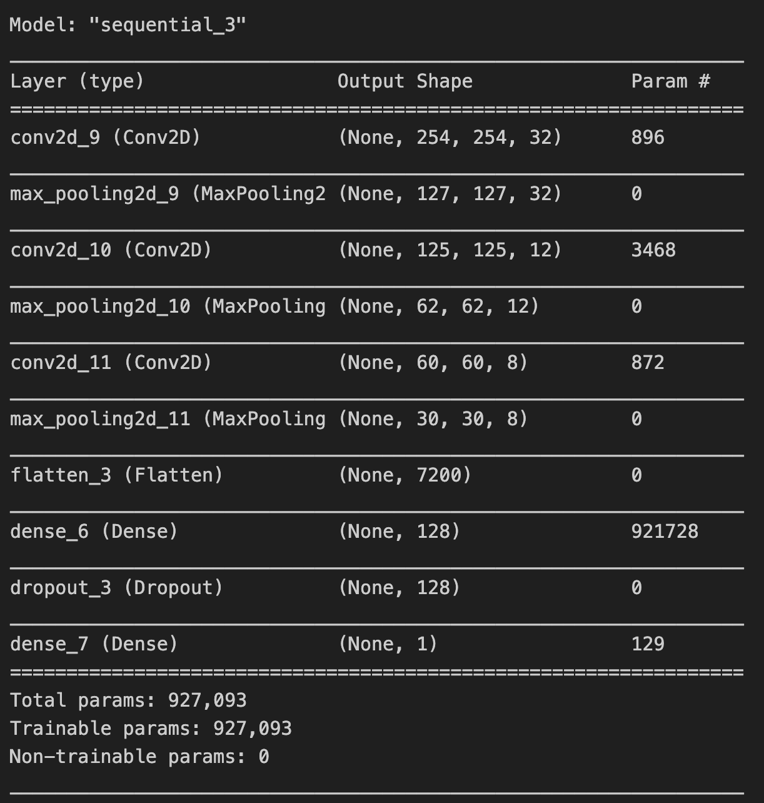

### Powdery Mildew in Cherry Leaves Detector

Powdery Mildew in Cherry Leaves Detector is a machine learning app designed to predict whether a cherry leaf is healthy or infected with powdery mildew, a common fungal disease. By processing images of cherry leaves, the app performs a binary classification to help determine the health status of a given leaf.

[View the live project here](https://cherry-ml-2c1328018520.herokuapp.com/)

---

## **Table of Contents**

1. [Business Context](#business-context)
2. [Dataset](#dataset)
3. [Business Requirements](#business-requirements)
4. [Project Hypothesis](#project-hypothesis)
5. [Model Design and Metrics](#model-design-and-metrics)
6. [Dashboard Design](#dashboard-design)
7. [Technologies Used](#technologies-used)
8. [Deployment](#deployment)
9. [Bugs](#bugs-fixed)
10. [Credits and Acknowledgments](#credits-and-acknowledgments)

---

## **Business Context**

Powdery mildew is a parasitic fungal disease caused by *Podosphaera clandestina* in cherry trees. Infected plants display powdery white spots on leaves and stems, which can significantly impact the quality and yield of cherry crops. Currently, Farmy & Foods, a cherry plantation company, conducts manual inspections to detect powdery mildew—a process that takes approximately 30 minutes per tree. This manual method is time-consuming and unscalable, leading to inefficiencies in large-scale operations.

---

## **Dataset**

- **Source**: The dataset was retrieved from [Kaggle](https://www.kaggle.com/datasets/codeinstitute/cherry-leaves) and contains 4,208 images (256x256 pixels each) of both healthy and powdery mildew-infected cherry leaves.
- **Image Composition**: The dataset is equally weighted with images of healthy and infected leaves (50% each).
- **Purpose**: This dataset allows us to build a binary classification model to automate the identification of powdery mildew infection.

---

## **Business Requirements**

The client, Farmy & Foods, has two principal requirements:
  1 - Visually differentiate between healthy and infected cherry leaves.
  2 - Use image-based predictions to identify powdery mildew infection in cherry leaves quickly and accurately.

By implementing this ML workflow, Farmy & Foods hopes to significantly reduce inspection time and improve crop quality through early detection and treatment of infections.

### * Rationale to map the business requirements to the Data Visualizations and ML tasks

- Business requirement 1:
  - This is not an ML model problem but a data exploration and visualisation problem. Through providing
   exploratory image montages and dataset analysis we prepare the dataset for efficient model training.

- Business requirement 2:
  - This ML-based app was developed to streamline the detection process. By uploading images of cherry leaves, staff can obtain an instant health assessment of each leaf, allowing for quicker and more effective disease management.
  - This is a binary classification problem. Given the available image dataset, a CNN will be suitably equipped for training a suitable model for this problem.
  - We want the model to predict the likelihood as a percentage that a given leaf is infected or not, based on the provided image dataset from the client. The ideal outcome is for the model to score at least 97% in accuracy, providing a clear and well generalised understanding of the image data patterns between the two classes (healthy and infected), providing not only the answer to which class an unseen leaf image likely lies, but also how likely it is to belong to that class. The model output is a class prediction and a likelihood of belonging to that class as a float.
  - The training data is split into precisely equal classes (healthy, infected), totalling 70% of the total dataset image count. Image labels are assigned from the given file structure, due to the raw dataset organisation already having structured the total dataset into the two classes.
  - Data augmentation will be neccessary for the given dataset due to the small dataset size: this will
  enable efficient and well generalised training of the model for a variety of contexts, without overfitting due to color, shape or image size overreliance.

---

## **Project Hypothesis and Validation Steps**

- **Hypothesis 1**: It is hypothesized that infected cherry tree leaves will be visually differentiable from healthy cherry tree leaves. Specifically, white powdery mildew will be present on the surface of
the majority of infected leaves within the dataset.
- **Validation**:
  - **Image Montage**: To visually illustrate the differences between healthy and infected leaves.
  - **Average Image Per Class**: Calculating the average image for both healthy and infected leaves to identify any distinct color or texture patterns.
  - **Difference Between Averages**: Comparing the average images of healthy and infected leaves to highlight visual differences.

- **Hypotheesis 2**: It is hypothesised that using only the provided dataset, the ML model will be able to distinguish between a healthy cherry leaf and an infected cherry leaf with at least 97% accuracy.
- **Validation**:
  - **Accuracy Evaluation on Test Set**: After model training, model evaluation will measure accuracy and loss readings. Accuracy above 97% per business requirement 2, will pass. This is ultimately the main business driver.
  -**Model Output**: Accuracy 99.88% (*Pass True*)

- **Hypothesis 3 (technical)**: It is hypothesised that at least 20 epochs will be required for effective generalisation of the data from the given dataset.
  - **Validation**: Epoch count during training once model has been fitted
  -**Model Output**: From early stopping, only 11 epochs were needed for suitable accuracy results.

---

## **Model Design, Heuristics and Metrics**

This project utilizes a Convolutional Neural Network (CNN) model built with TensorFlow and Keras. Given the visual complexity of distinguishing powdery mildew from healthy leaves, a CNN is well-suited for this image classification task.

- **Model Structure**: 
  - 
- The model has 927,093 trainable params, trained on a dataset of 4,208 labelled images. It uses a binary
classification approach to predict the likelihood of powdery mildew presence, per business requirement 2.
  - *Learning Method Justification*:
  - 3 convolutional layers, each decreasing in size for iterative refinement. The size was eventually reduced dramatically for all layers to reduce overfitting.
  - After each convolutional layer, a max pooling layer has been used to achieve translation invariance, ensuring learnt patterns from that convolutional layer are retained. ([Further Information](https://machinelearningmastery.com/pooling-layers-for-convolutional-neural-networks/)).
  - Relu activation has been chosen so that the neural network can learn nonlinear relationships between features and labels.
  - Flattening has been equipped to ensure that a single dimensional matrix is passed to the first dense layer.
  - Dropout has been set to 0.5 after the first large dense layer so that the model can generalise better to avoid overfitting.
  - A single-neuron output layer using sigmoid activation is used for binary classification. Whilst softmax is a generalised version of sigmoid, the sigmoid algorithm mathematically provides a more streamlined output for binary classification as it outputs a direct probability for one of two classes. A dense layer of 2 neurons using softmax and categorical crossentropy *could* have been used, but this simply adds unnecessary complexity to the task at hand, being less computationally efficient for binary classificaion tasks.
  [Sources](https://machinelearningmastery.com/choose-an-activation-function-for-deep-learning/)

- **Performance Metrics**:
  - **Success/Fail**: 97% accuracy or higher must be achieved after training the model.
    - **Result**: The model achieved high accuracy on the training set, consistently above 97%, reaching 99.88% accuracy for published version.
    - **Relevance to user**: This will consistently provide a generalised very accurate prediction of likelihood of infection for the user, improving mildew infection detection rates and streamlining business operations for the client, per business requirement 1.
    - **Training Data Used**: 70% of client-provided image dataset (1472 images).
  - **Loss & Accuracy Over Epochs**: Detailed loss and accuracy plots showcase the model’s performance during training. Early stopping will be used to streamline efficient learning, based on accuracy not increasing further. Early stopping will have failed if accuracy was historically still increasing, and loss still decreasing.
    - **Model Output**: Early stopping showed a successful learning rate, stopping well before the 25th epoch, stopping at epoch 11.
  - **Epoch Length**: The model should not need to train for more than the number of batches available in the training data per epoch. Should less than 99% the training data be used, this will be considered a failure.

### *Model Iterations Summary:*

- v1:
  - 4 convolution layers, c.7m trainable params. Early stopping included. No batch normalisation. Batch size 20.
  - bizarre results with 100% accuracy: concerns of data leakage.

- v2:
  - no early stopping to observe model development over longer period of epochs (25)
  - removed one convolution layer: 4 may have been too complex for the small dataset
    - instead, v2 convolution layer 3 has largest number of filters
  - v2 includes batch normalisation before final dense layer
  - results were unreadable: input ran out of data and interrupted training.
    - steps per epoch needs revision

- v3 :
  - Findings showed that augmented training data was only used on first batch and was not recalled, hense the input ran out of data on subsequent epochs.
  - no early stopping yet - allow full 25 epochs for evaluation first
  - when fitting model, steps per epoch were handled directly by keras (which should be the same as train_set.samples // batch_size), but should call augmentation each time.
    - this showed no input data running out
    - keep early stop

- v4 plans:
        - early stopping
        - did not run out of data now that keras handles steps per epoch
        - batch normalisation before dense layer
        - huge spikes in overfitting (14M params)

- v5:
        - massively reduce complexity of model (max filters)
        - reduce overfitting
        - increase dropout to 0.5
        - increase batch size to 16
        - reduce early stop patience from 10 to 3
        - dataset leakage error due to incorrect handling of dataframe

- v6:
  - increase batch size to 20
  - correctly handle dataframes to avoid data leakage
  - successfully achieved over 97% accuracy with small loss
    - business requirement 2 outcome successful
    - validated using 20% of dataset for test set, 10% from validation set during training.

---

## **Dashboard Design**

The app dashboard provides an intuitive interface with five main pages for streamlined use and understanding of the model’s predictions and performance metrics:

### **Page 1: Quick Project Summary**

- **Overview**: Brief introduction to powdery mildew and its impact on cherry plantations.
- **Requirements Overview**: Displays the project’s business goals relating to ML objectives.

### **Page 2: Leaves Visualizer**

- **Dataset Summary**: Information about dataset size, source, and class balance.
- **Visual Analysis Components**:
  - Image montage of healthy and powdery mildew-infected leaves for side-by-side comparison.
  - Mean variability displays for healthy and infected leaves.
  - Difference between average healthy and infected leaf variability images.

### **Page 3: Powdery Mildew Detector**

- **File Upload and Prediction**: Users can upload images for instant analysis.
- **Prediction Output**: Displays a statement indicating whether the uploaded image shows a healthy or infected leaf.

### **Page 4: Project Hypothesis and Validation**

- **Hypothesis Display**: Explanation of visual distinctions between healthy and infected leaves.
- **Validation Methods**: Visual comparisons and metrics proving the model’s accuracy.

### **Page 5: ML Performance Metrics**

- **Label Frequency**: Shows the distribution of healthy and infected samples across training, validation, and test sets.
- **Model History**: Plots for accuracy and loss over epochs.
- **Evaluation Results**: Summary of model performance with metrics such as accuracy, loss, and F1 score.

---

## **Technologies Used**

### Languages

- **Python**

### Frameworks and Libraries

- **TensorFlow/Keras**: For building and training the CNN model.
- **NumPy**: Array operations.
- **Pandas**: Data manipulation.
- **Matplotlib & Seaborn**: Data visualization.
- **Streamlit**: Web application development library for dashboard build.
- **Plotly**: Interactive plots for data visualisation.
- **PIL**: Image processing.
- **Joblib**: Saving/loading model and pipeline.

### Deployment Tools

- **Git/GitHub**: Version control.
- **Heroku**: Deployment platform.

---

## **Deployment**

The app is hosted on Heroku, following these deployment steps:

- **Connect GitHub Repository**: Link the Heroku app to the project’s GitHub repository.
- **Set Deployment Branch**: Select the branch for deployment.
- **Deploy Branch**: Deploy from linked GitHub repository.
- **Configure Stack**: Adjust Heroku stack version as required (resolved Python compatibility issues by switching to stack 20).

### *Bugs (fixed)*

- Heroku stack error on initial deployment: python ~3.8.19 is used per runtime.txt. The following steps were completed to solve the issue.

> [!TIP]
>
> - Via heroku CLI:
> Config via API key
> `heroku config (use personal API link)`
> set stack to stack 20
> `heroku stack:set heroku-20 -a [app_name]`

- **Slug Size**: Managed large files by adding them to `.slugignore`.

[App live link](https://cherry-ml-2c1328018520.herokuapp.com/)

---

## **Credits and Acknowledgments**

- **Project References**:
  - [Code Institute Malaria Walkthrough Project](https://learn.codeinstitute.net/courses/course-v1:code_institute+CI_DA_ML+2021_Q4/courseware/07a3964f7a72407ea3e073542a2955bd/29ae4b4c67ed45a8a97bb9f4dcfa714b/)

- **Content Sources**:
- [Streamlit documentation](https://docs.streamlit.io/)
- [Wikipedia](https://en.wikipedia.org/wiki/Powdery_mildew)
- Code Institute Slack community
- [Towards Data Science](https://towardsdatascience.com/)
- Alpkaan Celik

- **Mentorship**: Special thanks to my mentor, **Precious Ijege**, for their invaluable support and guidance throughout the project.

---
